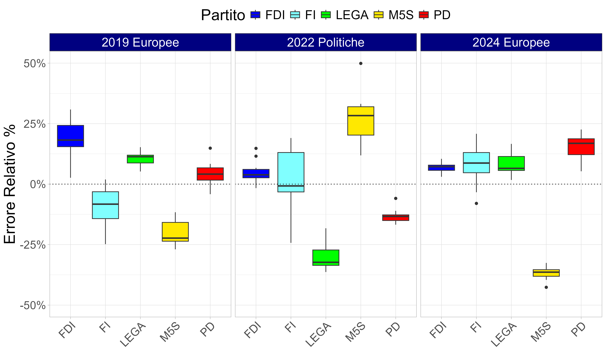
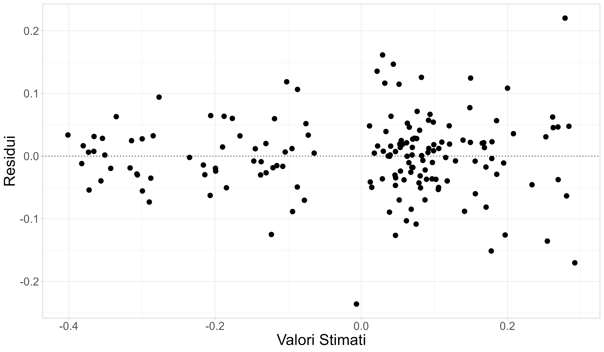
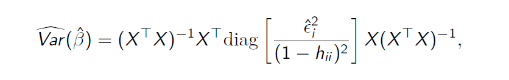

# Polling Error Analysis

In this document the polling error analysis is carried out. Specifically, the first objective is to investigate the presence of systematic biases in the forecasts of voters' intentions provided by polling agencies for each selected party and election. The second objective is to assess the precision of the agencies' forecasts, with a particular focus on whether some agencies are more reliable than others. The analysis closely mirrors the implementation in the R script [error_analysis.R](R/error_analysis.R).

> **Prerequisite**  
> This document assumes that the reader is familiar with the introductory framework outlined in [intro.md](intro.md) and in [filter.md](filter.md).

---

## Preliminary remarks

The results are shown only for the definition of the response variable that relies on the interpolation of the polls up to the election day, but they are also valid for the alternative definition, the one that uses the last poll prior to the election.

The code chunk below initializes the working environment and loads some useful packages. It then imports the dataset polling_error2.csv.

The dataset is organized as a cross-sectional structure in which each observation corresponds to a specific combination of polling agency, political party, and election. The explanatory variables are categorical and identify these three dimensions, while the response variable measures the forecasting error relative to the actual electoral outcome, according to the definition introduced in [intro.md](intro.md) and in [filter.md](filter.md). This structure allows for the assessment of both systematic biases and differences in predictive accuracy across agencies.

```r
rm(list = ls())

library(ggplot2)
library(ggthemes)
library(broom)
library(knitr)    # aesthetically pleasing tables
library(car)      # forecasting with arbitrary vcov matrix
library(sandwich) # robust estimates of standard errors
library(lmtest)

dataset <- read.csv("polling_error2.csv", header = TRUE, stringsAsFactors = TRUE)
```

## Presence of Systematic Biases

The image below shows the conditioned boxplots of the response variable by the independent variable Agency. No clear pattern emerges, suggesting that polling agencies do not differ systematically in terms of relative error.


The image below shows the jointly conditioned boxplots of the response variable by the independent variables Party and Election. In this case, some patterns emerge, suggesting that these two factors may help explain the response variable. Moreover, the response varies differently across Party-Election combinations, suggesting the presence of an interaction between these factors. Therefore, an appropriate model should include an interaction term between Party and Election.



Hence, the following linear model is fitted and an ANOVA is performed. The analysis of variance allows for the assessment of the relative importance of the different sources of variation, namely the factors Agency, Party, Election, and their interaction.

The ANOVA results are summarised in the table below. Focusing on the p-value column, the p-value associated with the Agency covariate is greater than the chosen significance threshold. This indicates that the polling agency does not contribute to explaining the variability of the response variable, and its inclusion in the model does not improve the model fit.

In contrast, the p-values associated with Party and with the interaction term are extremely small. Therefore, the null hypothesis can be rejected, suggesting that these sources of variation play a relevant role in explaining the response variable.

In light of these results, it appears reasonable to fit a new linear model that excludes the Agency variable.

```r
m1 <- lm(rel_err2 ~ Istituto + Partito * Elezione, data = dataset)
( tab1 <- anova(m1) )

m2 <- lm(rel_err2 ~ Partito * Elezione, data = dataset)
```

<div align="center">
  
| Term              | Df  | Sum Sq | Mean Sq | F value | Pr(>F)        |
|-------------------|-----|--------|---------|---------|---------------|
| Istituto          | 10  | 0.0418 | 0.00418 | 0.9234  | 0.5137        |
| Partito           | 4   | 0.7314 | 0.18286 | 40.3507 | < 2·10⁻¹⁶     |
| Elezione          | 2   | 0.0211 | 0.01056 | 2.3306  | 0.1010        |
| Partito:Elezione  | 8   | 4.2531 | 0.53163 | 117.3138| < 2·10⁻¹⁶     |
| Residui           | 140 | 0.6344 | 0.00453 | —       | —             |

</div>

However, a visual inspection of the residuals suggests the possible presence of heteroskedasticity.



This is problematic, as standard inferential procedures — such as those based on ANOVA — may become inappropriate, potentially leading to incorrect inferential conclusions. To address this issue, a Wald test is performed on the two nested models, `m1` and `m2`, using a heteroskedasticity-robust estimator of the variance–covariance matrix. Several types of heteroskedasticity-consistent covariance matrix (HCCM) estimators exist; the one employed here is the following:



The null hypothesis is not rejected: the Agency variable does not significantly improve the model fit. Therefore, this additional test corroborates the results obtained earlier.

```r
waldtest(m2, m1, vcov = vcovHC(m1))
```


